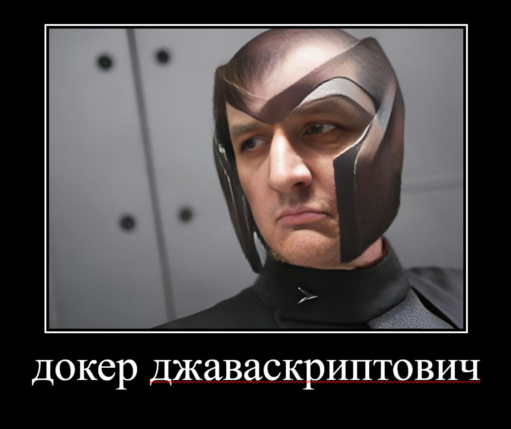

<h1 align="center">Привет, я Алексей 👋</h1>

  👨‍💻 Fullstack-разработчик | Next.js, NestJS, Docker | TypeScript, PostgreSQL, Prisma

### 🧠 Обо мне

- 🔭 Сейчас работаю над: **Магазин турецких сладостей**
- 🌱 Изучаю: **DevOps, CI/CD, продвинутый Docker**
- 💬 Спрашивайте меня о: `Next.js`, `NestJS`, `Prisma`, `TypeScript`
- ⚡ Факт: люблю автоматизацию и читаемый код

---

### 🛠️ Стек

  
  
  
  
  

### 📈 GitHub Статистика

  
 

<!--    -->

### 📫 Контакты

- 💬 Telegram:  @alexdenuke
- 📧 Почта: alexdenuke@gmail.com

Спасибо, что заглянул!

<!--
**alexdenuke/alexdenuke** is a ✨ _special_ ✨ repository because its `README.md` (this file) appears on your GitHub profile.

Here are some ideas to get you started:

- 🔭 I’m currently working on ...
- 🌱 I’m currently learning ...
- 👯 I’m looking to collaborate on ...
- 🤔 I’m looking for help with ...
- 💬 Ask me about ...
- 📫 How to reach me: ...
- 😄 Pronouns: ...
- ⚡ Fun fact: ...
-->
